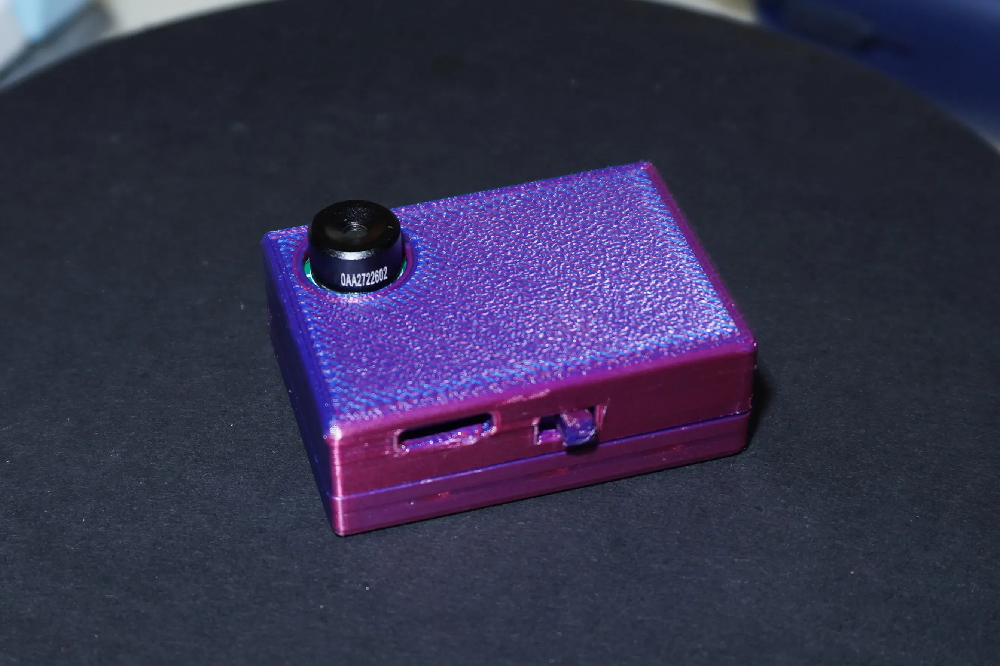
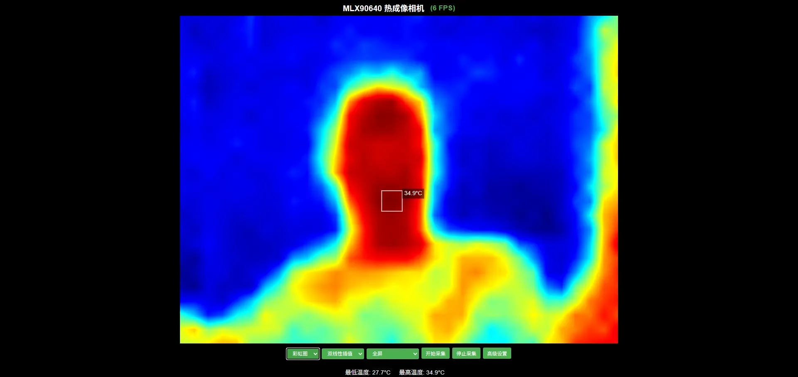
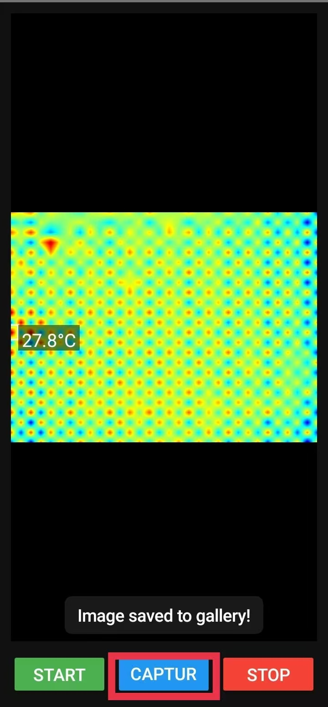
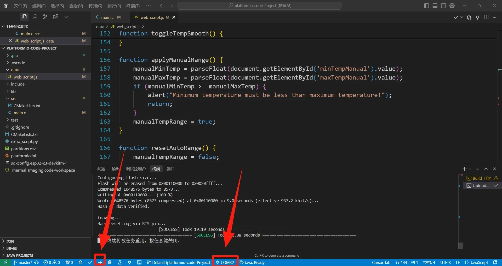
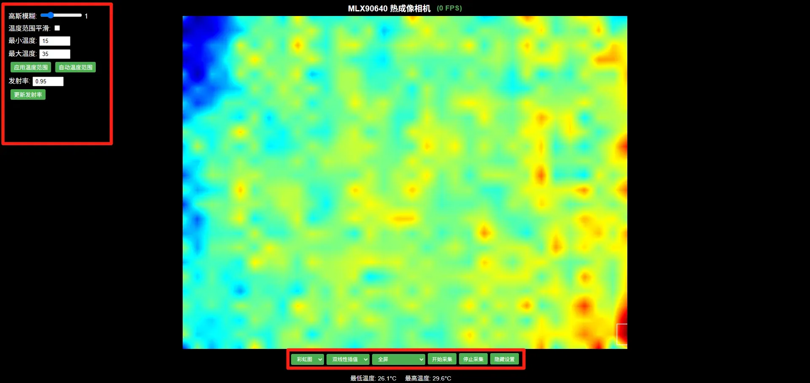
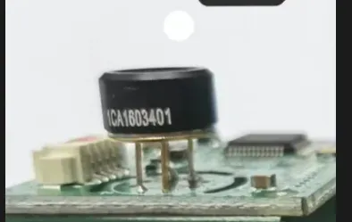
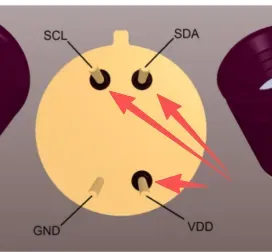

# MLX90640 Thermal Imaging Camera Project

[简体中文_说明](README_ZH.md)



## Project Introduction

This is a DIY ultra-portable WiFi thermal imaging camera using MLX90640 sensor. It's compact, portable, supports charging, and features a snap-on shell design that requires no screws or glue. You can view real-time images on your phone or computer browser, with support for zoom interpolation, color mapping, and temperature measurement. Free modification and commercial use are allowed and encouraged.

This project requires advanced soldering skills.

**Ready-made Purchase:** [Click Here](www.tindie.com/products/39742/)

**Project Author:** SuperJun  
**Open Source Address:** https://github.com/xzj2004/ircam  
**Project Collaboration WhatsApp:** +86 17354491260  
**Open Source License:** MIT (Free modification, distribution, and commercial use allowed)

## Project Purpose

I originally designed it for quickly locating abnormally hot components during PCB hardware debugging. Compared to expensive professional thermal cameras, this DIY solution is lighter, lower cost, with easily available components, and convenient to use anytime.

## Project Specifications

* This design uses MLX90640 infrared camera, 32×24 pixels, I2C interface communication, compatible with 3.3V/5V levels
* Main controller uses ESP32-C3, supports WiFi and Bluetooth, lower cost compared to ESP32 series
* Main controller software development uses PlatformIO's ESP-IDF environment
* ESP32-C3 works in AP mode with built-in web page and DNS resolution service

## Core Features

### 1. Thermal Imaging Data Collection
- **Sensor:** MLX90640 32×24 pixel infrared thermal imaging sensor
- **Resolution:** Supports multiple interpolation resolutions (32×24, 96×72, 160×120, 224×168, 288×216, 384×288)
- **Sampling Frequency:** Adjustable data acquisition frequency
- **Temperature Range:** Supports automatic and manual temperature range settings

### 2. Real-time Image Processing
- **Interpolation Algorithms:** Bilinear interpolation and nearest neighbor interpolation
- **Color Mapping:** Supports rainbow, heat map, hellfire, turbo, and other color schemes
- **Image Enhancement:** Advanced processing features like Gaussian blur, temperature range smoothing
- **Hotspot Detection:** Automatically identifies and marks the highest temperature location

### 3. Web Interface Control
- **Responsive Design:** Supports full-screen display and multiple resolutions
- **Real-time Control:** Start/stop acquisition, parameter adjustment
- **Advanced Settings:** Emissivity adjustment, manual temperature range setting
- **FPS Display:** Real-time frame rate monitoring

### 4. Network Functions
- **WiFi Hotspot:** Automatically creates "IRCAM-XXXX" hotspot network (XXXX is random 4 alphanumeric characters)
- **Web Server:** Built-in HTTP server provides control interface
- **Multi-client Support:** Supports up to 4 clients connected simultaneously

## Working Principle

This project consists of the following parts: voltage regulation and power selection, main controller, charging circuit, I2C communication, and download interface. The project mainly receives infrared data through the infrared sensor, ESP32 transmits it to the user's web page for parsing and image display. Various adjustment parameters are preset for you to try and experience.

## Product Images

### Physical Device


### Web Interface


## Android APP

In addition to the web interface, I also developed a dedicated APP for Android devices, providing a smoother user experience and more features.

**APP Documentation and Download:** [Click Here](http://yunqian.xyz/products/thermal-imaging/)



## Project Structure

```
platformio-code-Project/
├── src/                          # Main source code
│   ├── main.c                   # Main program file (779 lines)
│   └── CMakeLists.txt          # CMake build configuration
├── lib/                         # Project libraries
│   ├── MLX90640/               # MLX90640 sensor driver library
│   │   ├── MLX90640_API.h      # API interface header file
│   │   ├── MLX90640_API.cpp    # API implementation (1184 lines)
│   │   └── MLX90640_I2C_Driver.h # I2C driver interface
│   └── README                   # Library documentation
├── data/                        # Web resources
│   └── web_script.js           # Frontend JavaScript code (469 lines)
├── platformio.ini              # PlatformIO project configuration
├── partitions.csv              # ESP32 partition table configuration
└── extra_script.py             # Custom build script
```

## Software Code

GitHub Source Code: [Click to Jump - ircam](https://github.com/xzj2004/ircam)
* Main program: `src/main.c`
* Web JavaScript: `data/web_script.js`
* MLX90640 driver: `lib/MLX90640/MLX90640_API.cpp`
* `extra_script.py` is the script for flashing JS files to flash

## Core Code Location Description

### 1. Main Program Logic - `src/main.c`

#### Thermal Imaging Sensor Initialization and Configuration
```c
// Lines 120-130: I2C configuration
#define I2C_MASTER_SCL_IO    GPIO_NUM_5        // I2C clock pin
#define I2C_MASTER_SDA_IO    GPIO_NUM_4        // I2C data pin
#define I2C_MASTER_FREQ_HZ   400000            // I2C frequency 400kHz

// Lines 132-135: MLX90640 configuration
const uint8_t MLX90640_I2C_ADDR = 0x33;       // Sensor I2C address
static paramsMLX90640 mlx90640_params;         // Sensor parameters
static float mlx90640_temperatures[768];       // Temperature data buffer
```

#### I2C Communication Driver Implementation
```c
// Lines 150-200: MLX90640_I2CRead function
// Implements I2C communication to read data from MLX90640

// Lines 200-250: MLX90640_I2CWrite function  
// Implements I2C communication to write data to MLX90640
```

#### Data Acquisition Task
```c
// Lines 300-400: frameCaptureTask function
// FreeRTOS task responsible for continuously collecting thermal imaging data
```

#### Web Server and HTTP Handling
```c
// Lines 500-600: HTTP request handling functions
// Includes API interfaces for data acquisition, parameter settings, etc.
```

#### HTML Page Generation
```c
// Lines 50-110: HTML page template
// Contains complete Web interface HTML code
```

### 2. Frontend JavaScript - `data/web_script.js`

#### Canvas Rendering and Image Processing
```javascript
// Lines 1-50: Canvas initialization and basic settings
const canvas = document.getElementById('thermalCanvas');
const ctx = canvas.getContext('2d');

// Lines 50-100: Color mapping and interpolation algorithms
const colormaps = {
    hot: [[0,0,0],[0.3,0,0],[0.6,0.3,0],...],
    jet: [[0,0,0.5],[0,0,1],[0,1,1],...],
    // ... other color schemes
};
```

#### Real-time Data Acquisition and Display
```javascript
// Lines 200-300: Data acquisition and rendering loop
// Implements data communication with backend and real-time display updates
```

#### User Interaction Control
```javascript
// Lines 300-400: User interface control logic
// Includes resolution switching, color scheme selection, parameter adjustment, etc.
```

### 3. MLX90640 Driver Library - `lib/MLX90640/`

#### API Interface Definition
```cpp
// MLX90640_API.h - Lines 1-73
// Defines all API function interfaces for sensor operations
```

#### Core Algorithm Implementation
```cpp
// MLX90640_API.cpp - Lines 1-1184
// Contains core algorithms for temperature calculation, calibration, data processing, etc.
```

## Hardware Connection

| ESP32-C3 Pin | MLX90640 Pin | Function Description |
|-------------|-------------|----------|
| GPIO5      | SCL         | I2C clock line |
| GPIO4      | SDA         | I2C data line |
| 3.3V       | VDD         | Power positive |
| GND        | VSS         | Power ground |

## Important Notes

* Thermal camera hotspot name: IRCAM-XXXX (XXXX is a random combination of 4 letters/numbers), no password required

* Browser access address: ircam.com or 192.168.1.4, **must** connect to WiFi first before accessing [Click to Jump - Thermal Camera Web](http://ircam.com/)
* ESP32-C3 chip must have built-in flash, 4M is sufficient
* MLX90640 has two model options, choose according to your needs. I use BAA model here


## Flashing Process

After configuring the PlatformIO environment (search "PlatformIO installation tutorial" on Bilibili for specific tutorials):
Open the project - select the correct port - click the right arrow at the bottom of the window to flash



After flashing, the program runs automatically. Connect to the WiFi named "IRCam" (password: 12345678), access ircam.com in your browser to view the thermal image



There are many parameters and modes that can be adjusted to achieve the desired effect

## Soldering Tips

Solder the board and perform software flashing test first. The thermal imaging head can be left unsoldered initially, then soldered after successful testing.

It's not recommended to solder the thermal imaging head flush against the board, as it can easily cause short circuits.
Recommended soldering method - leave some floating distance:



If solder completely covers these holes, issues like inability to power on or no image display will occur:



## Q&A Troubleshooting

**Q:** Plugging in USB, computer shows unrecognized device / no response when USB is plugged in  
**A:** Most likely the Type-C D+/D- pins are not soldered properly, please check

## Usage Instructions

### 1. Compilation and Flashing
```bash
# Compile using PlatformIO
pio run

# Flash to ESP32-C3
pio run --target upload
```

### 2. Connection and Configuration
1. Connect the MLX90640 sensor to the specified pins on ESP32-C3
2. After powering on, ESP32-C3 will automatically create an "IRCAM-XXXX" WiFi hotspot
3. Connect to the WiFi hotspot (no password required)
4. Access ircam.com or 192.168.1.4 in a browser

### 3. Functional Operation
- **Start Acquisition:** Click the "Start Acquisition" button to start thermal imaging
- **Resolution Adjustment:** Select different interpolation resolutions
- **Color Scheme:** Choose different temperature color mappings
- **Advanced Settings:** Adjust emissivity, temperature range, and other parameters

## Technical Features

- **Real-time Performance:** Optimized data acquisition and rendering algorithms
- **Multi-resolution Support:** Multiple resolutions from original 32×24 to 384×288
- **Advanced Image Processing:** Supports various interpolation algorithms and image enhancements
- **Responsive Web Interface:** Supports various device screen sizes
- **Open Source License:** MIT license, supports commercial use

## Notes

- This project is for learning and exchange purposes only, please do not use for illegal purposes
- Please ensure the MLX90640 sensor is correctly connected before use
- It is recommended to use in a well-ventilated environment to avoid sensor overheating
- Temperature measurement accuracy is affected by environmental factors, regular calibration is recommended

## Community Group


## Contribution and Collaboration

Welcome to submit Issues and Pull Requests to improve the project. If you have creative ideas or project implementation needs, please contact the author through WhatsApp at `+86 17354491260` for collaboration.

## License

This project is licensed under the MIT open source license, please refer to the LICENSE file for details.
